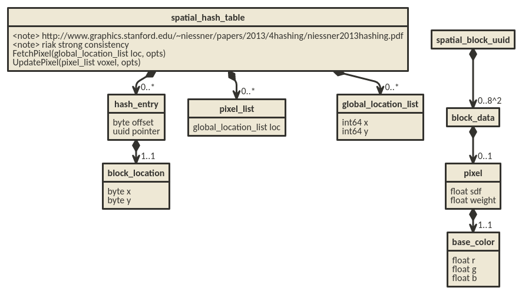

# Sunshine's Battleacademy design document

## Gateway

For n bucket (8^2) fetch all keys 60 times a second.

* send updates repeated 1000 / network update factor

## Commands

* connection
* gotit
* pingcheck
* windowresize
* respawn
* disconnect
* playercheck
* pass
* kick
* 0 (heartbeat)
* 1 (fire food)
* 2 (split cell)

## Agent proxy's game loops

THERE IS NO GAME MANAGER OR LOOP THAT MANAGES THE ENTIRE STATE OF THE WORLD.

Per entity.

* move loop repeated 1000ms / 60
  - tick player
  - move food
* game loop repeated 1000ms

## Designs

